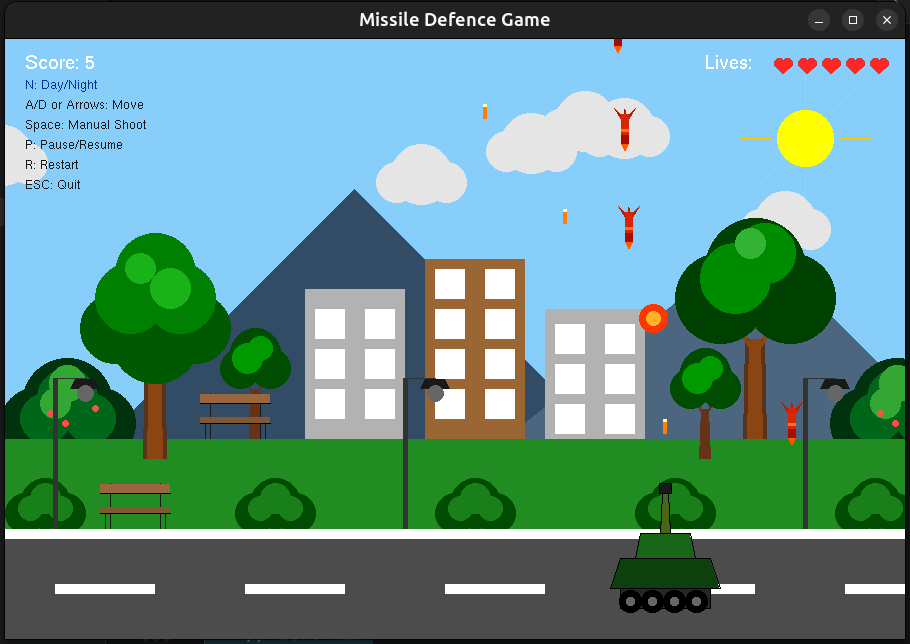
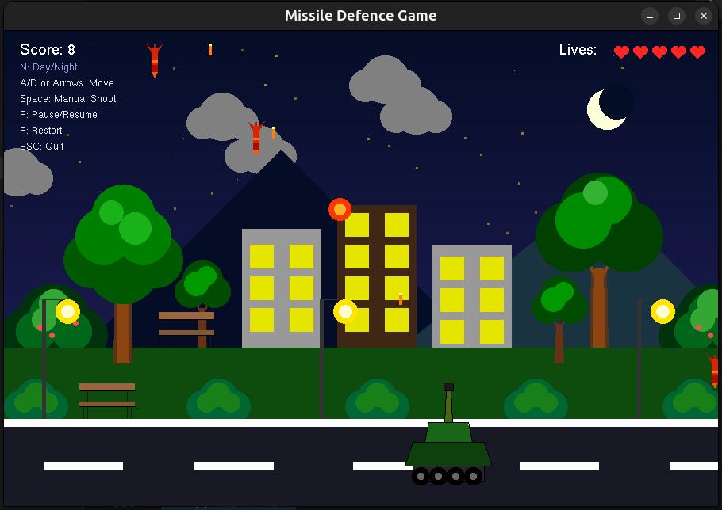
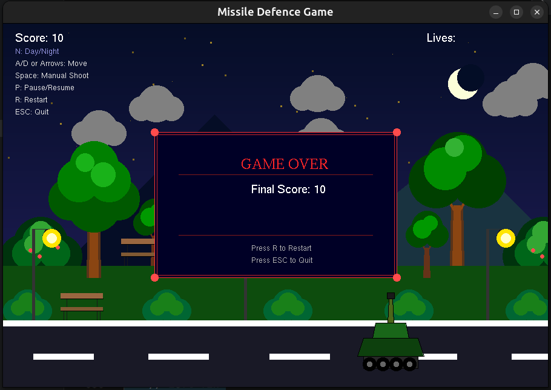

# 🚀 Missile Defence Game

A 2D shooter game built with OpenGL and GLUT where you control a tank to defend against incoming missiles. Built from scratch using fundamental computer graphics algorithms.


---

## 📖 About

This is our final project for the **Computer Graphics Lab (CSE412)** course at **Daffodil International University**, Spring 2026 (8th Semester).

The game is a classic missile defence concept — missiles fall from the sky, and you move a tank left/right on the road to shoot them down. If 5 missiles hit the ground, it's game over.

Everything is drawn using **Bresenham's Line Algorithm** and **Midpoint Circle Algorithm** — no built-in shape functions. The entire scene (sky, mountains, buildings, trees, road, tank, etc.) is hand-crafted pixel by pixel.

---

## 🎮 How to Play

| Key | Action |
|-----|--------|
| `A` / `←` | Move tank left |
| `D` / `→` | Move tank right |
| `Space` | Manual shoot |
| `P` | Pause / Resume |
| `N` | Toggle Day / Night |
| `R` | Restart game |
| `ESC` | Quit |

- The tank **auto-fires** every ~0.25 seconds
- New missiles spawn every ~1.1 seconds
- **5 missiles hitting the ground = Game Over**

---

## 🖥️ Screenshots

### Day Mode


### Night Mode


### Game Over

---

## 🔧 Algorithms Used

### 1. Bresenham's Line Drawing Algorithm
Used for drawing:
- Sun rays
- Tank borders and outlines
- Road markings
- Building outlines
- Bench structure
- Lamp posts
- Game over panel borders

### 2. Midpoint Circle Algorithm (Filled)
Used for drawing:
- Sun, Moon
- Clouds
- Stars
- Tree canopies and bushes
- Tank wheels
- Bullets and explosions
- Hearts (lives indicator)
- Lamp bulbs

---

## 🏗️ Project Structure

```
missile-defence-game/
├── main.cpp          # Complete game source code
├── README.md         # This file
└── screenshots/      # Game screenshots (optional)
```

Single file project. Everything is in `main.cpp`.

---

## ⚙️ Build Instructions

### Prerequisites
- GCC / G++ compiler
- OpenGL, GLU, and GLUT libraries

### Linux (Ubuntu/Debian)

```bash
# Install dependencies
sudo apt update
sudo apt install build-essential freeglut3-dev libgl1-mesa-dev libglu1-mesa-dev

# Compile
g++ main.cpp -o game -lGL -lGLU -lglut -lm

# Run
./game
```

### Windows (MinGW)

```bash
# Make sure MinGW and freeglut are installed
g++ main.cpp -o game.exe -lfreeglut -lopengl32 -lglu32

# Run
game.exe
```

### Windows (CodeBlocks)

1. Create a new empty OpenGL project
2. Add `main.cpp` to the project
3. Go to **Settings → Compiler → Linker Settings**
4. Add these libraries: `-lfreeglut -lopengl32 -lglu32`
5. Build and Run

---

## 🎨 Features

- **Complete 2D scene** — sky, mountains, buildings, trees, grass, road, lamp posts, benches, bushes
- **Day/Night toggle** — sky gradient, glowing windows, street lamp lights, moon with crescent effect, stars
- **Tank with detailed design** — wheels, armor, turret, barrel with muzzle flash
- **Falling missiles** with fins, stripes, and nose cone
- **Explosion effects** — growing fire rings that fade out
- **HUD** — live score counter, heart-shaped lives, control hints
- **Game Over screen** — final score, restart option
- **Smooth animation** — 60 FPS game loop with timer
- **Pause/Resume** support
- **Floating clouds** that drift across the sky

---

## 📐 Coordinate System

```
(0, 600) ──────────────────── (900, 600)
    │   SKY + CLOUDS + SUN/MOON          │
    │   MOUNTAINS                        │
    │   BUILDINGS + TREES                │
    │   GRASS + BUSHES + LAMPS           │
    │   ══ ROAD (tank moves here) ══     │
(0, 0) ────────────────────── (900, 0)
```

Window size: **900 × 600 pixels**

---

## 👥 Team Members

| Name | GitHub |
|------|--------|
| Kazi Amir Hamza | [@kazi-amir](https://github.com/kazi-amir) |
| Ummay Jubaiya Moushi | [@ujmoushi](https://github.com/ujmoushi) |
| Jannatul Mim | — |

---

## 📚 Course Info

| | |
|---|---|
| **Course** | Computer Graphics Lab (CSE412) |
| **University** | Daffodil International University |
| **Semester** | Spring 2026 (8th Semester) |
| **Instructor** | Nawshin Haque (Lecturer) |

---

## 📝 License

This project was made for educational purposes as part of our university coursework.

---
